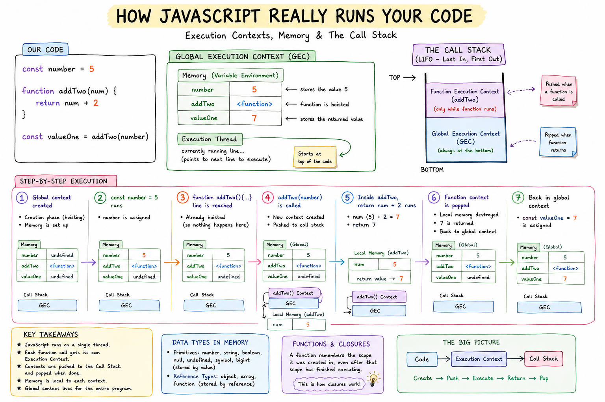

# How JavaScript Really Runs Your Code



## A visual guide to execution contexts, memory, and the call stack

If you've ever wondered what actually happens between you hitting "run" and your code producing an output, this post is for you. We'll build up the full mental model piece by piece — including _where_ your values physically live and how JavaScript cleans up after itself — then trace one small program through the entire machine, step by step.

By the end, you'll understand exactly why this works:

```js
const number = 5;

function addTwo(num) {
	return num + 2;
}

const valueOne = addTwo(number);
```

Not just _that_ it works — but _how_, at every level.

## 1. The big picture: one thread, one stack

The most important fact about JavaScript is also the easiest to forget: **it runs on a single thread.**

That means the engine can only do one thing at a time. There's no "run two functions simultaneously." Instead, JavaScript keeps a running record of what it's currently doing — and what it was doing _before_ that, and before that — using a structure called the **call stack**.

Think of the call stack like a stack of plates. You can only ever work on the plate at the top. To work on a new task, you put a new plate on top. When that task is done, you take the plate off and go back to whatever was underneath.

Everything in this post is really just an explanation of how JavaScript stacks and unstacks those plates — and, as we'll see, where the _contents_ of those plates actually live in memory.

## 2. Meet the building blocks

Before we trace any code, let's name the four concepts that do all the work.

### Execution context

An execution context is a **container** the engine creates every time it needs to run some code — whether that's your whole script or a single function call. Each context bundles together two things:

- **Memory** — where variables and function declarations actually live for that context
- **Execution thread** — a pointer to _which line_ is currently running inside that context

There are two kinds you'll encounter constantly:

- **Global execution context** — created once, when your script starts. There's only ever one of these.
- **Function execution context** — created fresh, every single time a function is called. If a function is called five times, five separate contexts are created, one after another.

### Memory (the variable environment)

Each execution context gets its own private memory. This is just a simple key-value store: variable names mapped to their current values. Crucially, a function's memory is **local** — code outside that function can't see or touch it.

### The call stack

The call stack tracks which execution context is currently active. It works LIFO — **last in, first out**. The global context goes in first and sits at the very bottom for the entire lifetime of the program. Every function call pushes a new context on top; every return pops one off.

### Data types

This is just what memory is allowed to hold: primitives like `number`, `string`, and `boolean`, plus reference types like `object`, `array`, and `function`. Worth knowing for later: primitives are copied by value when passed into a function, while objects are passed by reference. That distinction matters more once you start passing objects and arrays around — and it's the whole reason the next section exists.

## 3. Where do values actually live? Stack vs heap

So far we've talked about "memory" as one thing. In reality, the engine splits memory into two distinct regions, and _which type of value you're storing_ decides where it goes.

### The stack: for primitives

Primitive values — `number`, `string`, `boolean`, `undefined`, `null`, `symbol`, `bigint` — are small, fixed-size, and immutable. These are stored **directly on the stack**, right inside the execution context's memory we described above.

```js
let a = 5;
let b = a; // b gets its OWN copy of 5
b = 10;
console.log(a); // still 5
```

`a` and `b` are two completely separate values sitting in memory. Changing one never touches the other. This is what "passed/copied **by value**" means.

### The heap: for objects, arrays, and functions

Reference types are variable in size and can be large or deeply nested, so they don't live on the stack. Instead:

- The actual data is stored in a large, unstructured region of memory called the **heap**.
- The stack only holds a **reference** — a pointer to where that data lives in the heap.

```js
let obj1 = { count: 5 };
let obj2 = obj1; // obj2 gets a COPY of the reference, not the object
obj2.count = 10;
console.log(obj1.count); // 10 — both point to the SAME heap object
```

`obj1` and `obj2` are two separate stack entries, but both hold the _same_ heap address. Mutating through one is visible through the other. This is "passed/copied **by reference**."

| What you write       | Where it actually lives | What the stack holds                     |
| -------------------- | ----------------------- | ---------------------------------------- |
| `let x = 5`          | Stack only              | The value `5` itself                     |
| `let obj = { a: 1 }` | Heap                    | A reference/pointer to the heap location |

### The garbage collector: cleaning up after you

Here's the natural next question: if function execution contexts get destroyed the moment they're popped off the call stack, what happens to anything they had pointing into the heap?

That's the job of the **garbage collector (GC)** — a background process built into the engine that periodically scans the heap for objects nothing can reach anymore, and frees that memory.

The rule it uses is called **reachability**: an object stays alive in the heap for as long as _something_ still holds a reference to it, traced all the way back to a "root" (the global object, or a currently-running function's local variables). The moment the last reference disappears, the object becomes unreachable — and eventually the GC reclaims it.

```js
function createUser() {
	let user = { name: "Alice" }; // heap object created
	return user;
}

let currentUser = createUser(); // still referenced — stays alive
currentUser = null; // last reference gone — now eligible for garbage collection
```

Two things worth being precise about:

- **The stack cleans up immediately and deterministically.** The instant a function's execution context is popped, every primitive and every reference sitting in its local memory is gone — no delay, no scanning.
- **The heap cleans up lazily and non-deterministically.** An unreachable object doesn't vanish the instant it becomes unreachable — it just becomes _eligible_. The GC decides when to actually run and reclaim it, which is why you can't predict exactly when heap memory gets freed.

This is also why closures matter so much for memory: if an inner function keeps a reference to an outer variable, that variable's heap data stays reachable — and alive — for as long as the closure itself exists, even long after the outer function's execution context has been popped off the stack.

---

## 4. The global execution context: where it all begins

The moment your script starts, before a single line actually _runs_, JavaScript does something easy to miss: it creates the global execution context and quietly scans your entire file first.

This scanning step is called the **creation phase**, and it's responsible for a behavior that trips up a lot of people: **hoisting**.

### Hoisting: JavaScript's head start

During the creation phase, the engine walks through your code and pre-registers everything it finds, _before_ running anything:

- `function` declarations are hoisted completely — the whole function body is available immediately.
- `var` declarations are hoisted but set to `undefined`.
- `let` and `const` declarations are hoisted too, but they stay in an inaccessible "temporal dead zone" until the actual line runs.

So for our example, before line 1 even executes, global memory already looks like this:

```bash
number:    undefined
addTwo:    <the entire function>
valueOne:  undefined
```

This is exactly why you can call a function before its declaration appears later in the file — the engine already knows about it.

Once the creation phase finishes, the **execution phase** begins: the engine goes back to the top and runs your code line by line, updating memory as it goes.

## 5. The call stack in motion

Here's the part that makes everything click: **every function call is a detour.**

When the engine hits a function call, it doesn't just "go run that code somewhere." It:

1. Creates a brand new execution context for that function call
2. Pushes that context onto the top of the call stack
3. Gives it its own private memory
4. Starts executing inside it — the global context is now paused underneath

When the function finishes (hits a `return`, or simply runs out of lines), the engine:

1. Passes the returned value back to whoever called it
2. **Destroys** that function's execution context — memory and all
3. Pops it off the call stack
4. Resumes the context now sitting on top, exactly where it left off

This push-and-pop rhythm is the entire story of how JavaScript handles function calls, no matter how deeply nested they get.

## 6. Walking the example line by line

Let's put it all together with our original snippet:

```js
const number = 5;

function addTwo(num) {
	return num + 2;
}

const valueOne = addTwo(number);
```

**Step 1 — Global context created**
The call stack now holds one context: global. Creation phase hoists `number`, `addTwo`, and `valueOne` as shown above.

**Step 2 — `const number = 5` runs**
Global memory updates: `number = 5` (stored directly on the stack, since it's a primitive).

**Step 3 — the `function addTwo(){...}` line is reached**
Nothing happens here — it was already hoisted in step 1. The engine just moves on.

**Step 4 — `addTwo(number)` is called**
This is the detour. The engine:

- Creates a new function execution context for this call
- Pushes it onto the call stack, on top of global
- Creates fresh local memory for it: `num = 5` (a _copy_ of `number`'s value, since numbers are primitives and live on the stack)

**Step 5 — inside `addTwo`, `return num + 2` runs**
`5 + 2` evaluates to `7`. The function is done.

**Step 6 — the function's context is popped**
Its local memory (`num = 5`) is destroyed immediately. It no longer exists anywhere. The call stack shrinks back to just the global context. The value `7` is handed back to the call site.

**Step 7 — back in the global context**
Execution resumes exactly where it paused: `const valueOne = 7` is assigned. Global memory updates one last time.

**Final state, script complete:**

```bash
number:    5
addTwo:    <the function>
valueOne:  7
```

The call stack now holds only the global context, and it will stay that way until the script itself ends. Since nothing in this particular example ever touches the heap (no objects, arrays, or closures), there's nothing here for the garbage collector to worry about — every value lived and died on the stack.

## 7. Why this matters: closures

There's one more piece worth mentioning, because it's the natural follow-up question: **how does a function remember variables from outside itself, even after the outer function has finished running?**

The answer is that when a function is _created_ (not called — created), it keeps a reference to the scope it was born in. That bundle of "the function plus the variables it can see" is called a **closure**. It's why this works:

```js
function makeCounter() {
	let count = 0;
	return function () {
		count += 1;
		return count;
	};
}

const counter = makeCounter();
counter(); // 1
counter(); // 2
```

Even though `makeCounter`'s execution context is long gone from the call stack, the inner function still has access to `count` — because it captured that variable environment when it was created, not when it's called. As covered above, this is also why `count` lives on in the heap: the returned function still references it, so it stays reachable and the garbage collector leaves it alone.

## 8. Common misconceptions, cleared up

**"Functions run where they're written."**
Not quite — functions run wherever they're _called_, using an execution context created fresh at call time. Where they're written only determines what variables they can see (their scope), not when or how many times they execute.

**"Variables declared with `var`/`let`/`const` all behave the same during hoisting."**
They don't. `var` is hoisted and initialized to `undefined`. `let` and `const` are hoisted but stay unreachable until their line runs — accessing them earlier throws a `ReferenceError`, not `undefined`.

**"Objects and numbers behave the same way when passed into functions."**
They don't. Primitives (numbers, strings, booleans) are copied — the function gets its own independent value on the stack. Objects and arrays are passed by reference — the function gets a pointer to the _same_ object in the heap, so mutating it inside the function affects the original.

**"Setting a variable to `null` immediately frees its memory."**
Not immediately. It removes the last reference, making the object _eligible_ for garbage collection — but the actual reclaiming happens later, whenever the garbage collector next runs.

## 9. `var` vs `let` vs `const` — and the Temporal Dead Zone

We touched on hoisting differences back in section 4, but this deserves its own close look — it's one of the most common sources of confusing bugs, and it all comes down to what the creation phase does with each keyword.

### Scope: function vs block

`var` is **function-scoped**. It doesn't care about `{ }` blocks — only function boundaries (or the global scope) contain it.

```js
if (true) {
	var x = 10;
}
console.log(x); // 10 — leaked right out of the if-block
```

`let` and `const` are **block-scoped**. Any `{ }` — an `if`, a `for`, a bare block — creates a new boundary they can't escape.

```js
if (true) {
	let y = 10;
}
console.log(y); // ReferenceError: y is not defined
```

### Redeclaration and reassignment

| Keyword | Redeclare in same scope? | Reassign?      |
| ------- | ------------------------ | -------------- |
| `var`   | Yes                      | Yes            |
| `let`   | No (SyntaxError)         | Yes            |
| `const` | No (SyntaxError)         | No (TypeError) |

One nuance worth flagging: `const` doesn't make a value immutable — it makes the _binding_ immutable. You can't point `const obj` at a different object, but you can still mutate what it points to:

```js
const obj = { count: 1 };
obj.count = 2; // fine — the object is mutated, not reassigned
obj = {}; // TypeError — this IS a reassignment
```

That's the same stack-vs-heap split from section 3 showing up again: `const` freezes the reference sitting on the stack, not the data sitting in the heap.

### How each one behaves during the creation phase

This is the part that actually explains _why_ they behave differently, tying straight back into hoisting from section 4:

- **`var`** — hoisted and immediately initialized to `undefined`. It's fully usable (if empty) from the very top of its scope.
- **`function`** — hoisted with its entire body attached, as covered earlier.
- **`let` and `const`** — hoisted, but _not_ initialized. The engine reserves the name in memory but refuses to let you touch it until execution actually reaches its declaration line.

That gap — between the variable existing in memory and the variable becoming accessible — is the **Temporal Dead Zone (TDZ)**.

### The Temporal Dead Zone, precisely

Every `let`/`const` variable has a TDZ that starts at the top of its scope and ends the instant its declaration line finishes executing.

```js
console.log(a); // undefined — var is hoisted AND initialized
console.log(b); // ReferenceError — b is in the TDZ

var a = 1;
let b = 2;
```

Notice the error type: it's a `ReferenceError`, not `undefined`. That's the tell. `undefined` means "this variable exists but nobody's assigned it a value yet." A TDZ `ReferenceError` means "this variable exists in memory, but the engine is deliberately refusing to hand it to you yet."

Why does the TDZ exist at all? It's a safety net. Before `let`/`const`, `var`'s "hoist to `undefined`" behavior let you silently read a variable before its logical declaration and get a nonsensical value instead of a clear error. The TDZ turns that silent bug into a loud, immediate one.

```js
function example() {
	// TDZ for `count` starts here
	console.log(count); // ReferenceError
	let count = 5; // TDZ for `count` ends here
	console.log(count); // 5 — fine now
}
```

The TDZ isn't about _position in the file_ — it's about _execution order relative to the declaration line_. A `let` declared later in a function can still be read safely if you don't actually reach the read until after the declaration has run.

### Quick summary table

| Behavior                  | `var`       | `let` / `const`     |
| ------------------------- | ----------- | ------------------- |
| Scope                     | Function    | Block               |
| Hoisted?                  | Yes         | Yes                 |
| Initial value on hoist    | `undefined` | Uninitialized (TDZ) |
| Access before declaration | `undefined` | `ReferenceError`    |
| Redeclare in same scope   | Allowed     | SyntaxError         |

## 10. The one-paragraph summary

JavaScript runs on a single thread using a call stack. The engine starts by creating a global execution context and hoisting your declarations. Every function call creates a brand-new execution context — with its own private memory — that gets pushed on top of the stack and popped off the moment it returns. Primitives live and die on the stack, deterministically, the instant their context is popped; objects live in the heap and stick around for as long as something can still reach them, with the garbage collector reclaiming the rest on its own schedule. Nothing runs in parallel; everything is a controlled sequence of pushing contexts on, running them, and taking them back off. Once you can trace that push-and-pop rhythm — and follow where each value actually lives — the rest of JavaScript's quirks stop feeling like magic and start feeling like straightforward consequences of this one mechanism.
